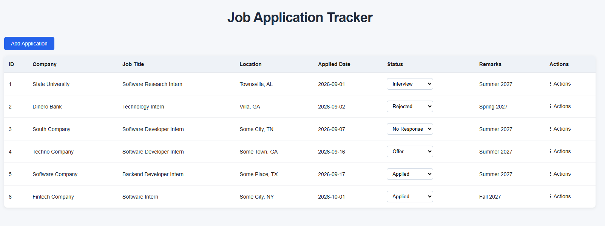
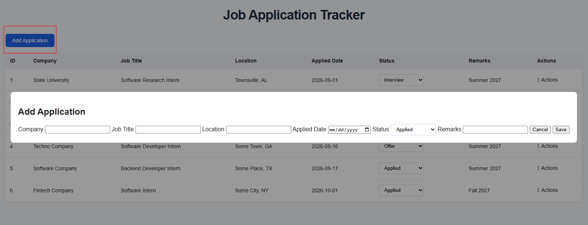
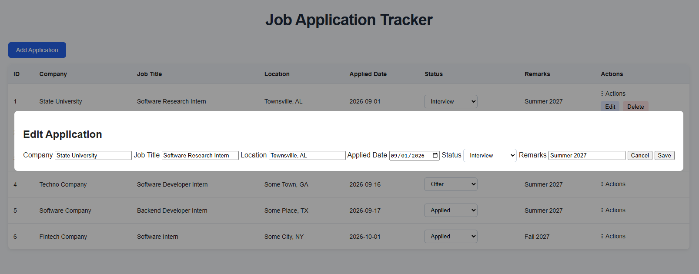
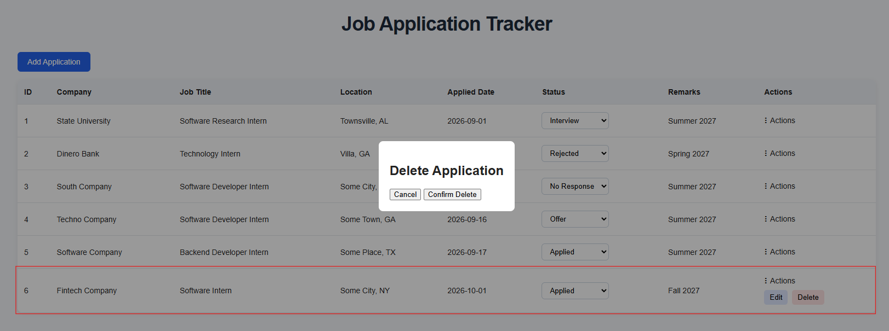
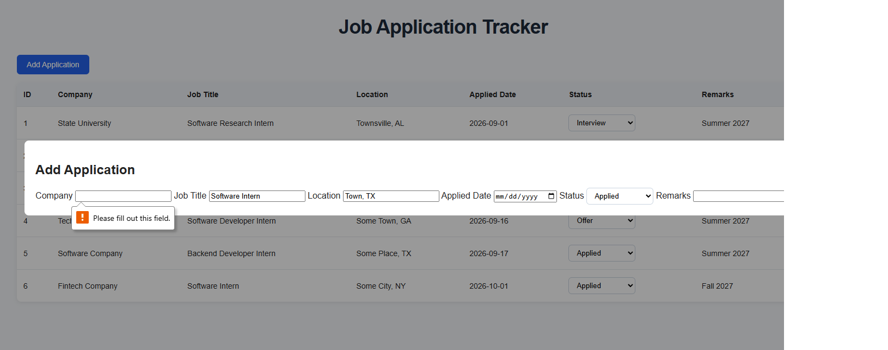

# Job Application Tracker

A full-stack web application for tracking and managing job applications, built with Python, Flask, SQLite, HTML, CSS, and JavaScript.

The project began as a Python command-line application and evolved into a browser-based application with persistent database storage and full CRUD functionality.



## Features

- Add, view, edit, and delete job applications
- Update application status directly from the application table
- Store application data persistently with SQLite
- Validate application data before saving changes
- Use modal forms for adding, editing, and deleting applications
- Maintain stable application IDs after records are deleted

## Demo

### Add a Job Application

Users can add a new application through a modal form with fields for the company, job title, location, applied date, status, and remarks.



### Edit an Application

Existing applications can be edited through a pre-filled modal, allowing users to update application details without re-entering the entire record.



### Delete an Application

Applications can be deleted through a confirmation modal to help prevent accidental removal.



### Input Validation

Application data is validated before changes are saved, helping prevent incomplete or invalid records from being stored.



## Application Data

Each application stores:

- Company
- Job title
- Location
- Applied date
- Status
- Remarks

Available statuses: `Applied`, `Interview`, `Offer`, `Accepted`, `Rejected`, `Withdrawn`, and `No Response`.

## Technologies

- **Backend:** Python, Flask
- **Database:** SQLite
- **Frontend:** HTML, CSS, JavaScript, Jinja2
- **Version Control:** Git, GitHub

## Application Architecture

```text
Browser
↓
HTML / CSS / JavaScript
↓
Flask
↓
Python application logic
↓
SQLite database
```

The browser provides the user interface, while Flask handles incoming requests and connects those requests to the application's Python logic. The Python layer performs validation and database operations, and SQLite stores application data persistently.

## What I Learned

Building this project helped me understand how the different layers of a full-stack application work together.

Through the project, I gained hands-on experience with:

- Connecting a browser-based frontend to a Flask backend
- Handling HTTP requests and routing with Flask
- Performing CRUD operations with SQLite
- Validating user input before database operations
- Passing data between Flask and Jinja templates
- Using JavaScript for client-side interactions and modal behavior
- Organizing a multi-file application
- Managing project changes with Git and GitHub

## Project Structure

```text
job-application-tracker/
├── screenshots/
│   ├── application-dashboard.png
│   ├── add-application.png
│   ├── edit-application.png
│   ├── delete-application.png
│   └── validation.png
├── static/
│   ├── script.js
│   └── style.css
├── templates/
│   └── index.html
├── app.py
├── main.py
├── tracker.py
├── .gitignore
└── README.md

## Project Status

The MVP is complete and supports the core workflow for tracking job applications through the web interface.

The project will continue to be refined with usability improvements, additional features, testing, and deployment.

### Planned Improvements

- Improve responsiveness across different screen sizes
- Add clearer user-facing validation messages
- Add search, filtering, and sorting
- Add automated tests
- Deploy the application publicly

## Run Locally

1. Clone the repository:

```bash
git clone https://github.com/nirmal-moktan/job-application-tracker.git

2. Open the project folder

cd job-application-tracker

3. Install Flask

pip install flask

4. Start the application

python app.py

5. Open the local address shown in the terminal in your browser

